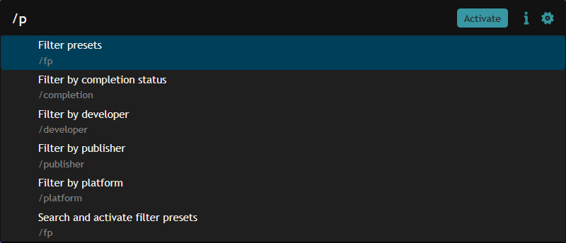
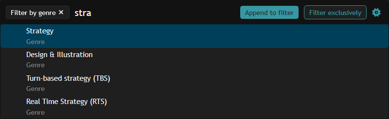

# Metadata Search
This extension lets you change your filter settings from the [Playnite keyboard launcher](https://api.playnite.link/docs/manual/features/keyboardLauncher.html).

For example, here's some of the search contexts that can be added (though the last one here is from [Filter Presets Quick Launcher](https://playnite.link/addons.html#FilterPresetsQuickLauncher_ef9df36c-24c2-418c-8468-eed95a09d950)):

## Usage
Let's say you want to filter your games list to the "Strategy" genre.

### Current Playnite ways
There's already a few ways you can do this, all with some drawback:

- Find a game that has the genre, and click on that genre in the detail view
  - This will clear the other genres from your filter
- Select the genre from the dropdown in the filter panel
  - This can be cumbersome if the dropdown has many values
- Type "Strategy" in the genre filter dropdown text field
  - This also filters to every other genre with "Strategy" in its name

### With this plugin

- Open the Playnite keyboard launcher (`ctrl+F` by default)
- Open the `genre` filter context in one of the following ways:
  - Type `/` to list the available search contexts. Turn it into `/genre`, then hit `space` or `enter`
  - Alternatively, type `genre` and then hit `space`. This saves you a `/` keystroke, but doesn't list the available search contexts before you enter one.
- Search for the genre you want by name. In the screenshot, typing `stra` gets us a few strategy genres.
- You can press the up or down keys to navigate between options
- You can press `TAB` switch between the two actions represented by the buttons at the top right
- Pressing `ENTER` activates the selected action.
  - **Append to filter**: Add the selected item to the relevant filter field. If you already had "Action" in the genre filter, you'll now have "Action, Strategy".
    - If the selected item is a filter preset, all filter fields will be merged into the currently active filter settings.
  - **Filter exclusively**: Clear all filter fields, then add the selected item to the relevant filter field.
    - If the selected item is a filter preset, this is just like activating a filter preset normally.

